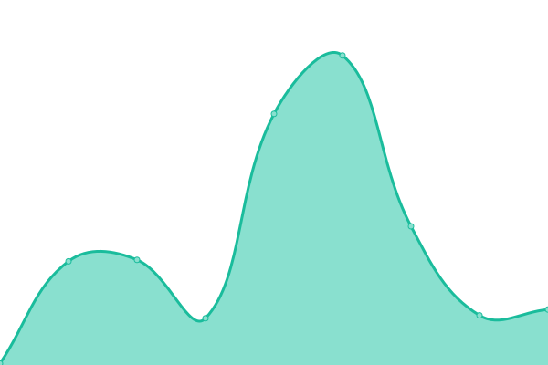
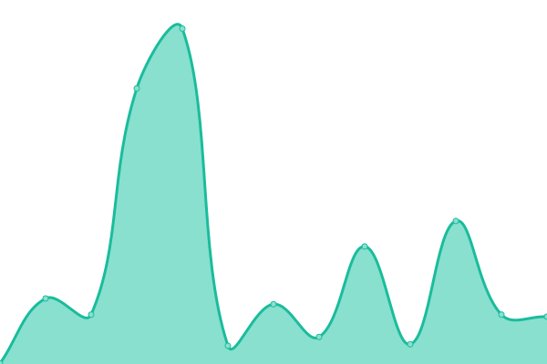

# [📈 Live Status](https://uptime.giaang.id.vn): <!--live status--> **🟧 Partial outage**

This repository contains the open-source uptime monitor and status page for [Upptime](https://upptime.js.org), powered by [Upptime](https://github.com/upptime/upptime).

With [Upptime](https://upptime.js.org), you can get your own unlimited and free uptime monitor and status page, powered entirely by a GitHub repository. We use [Issues](https://github.com/upptime/upptime/issues) as incident reports, [Actions](https://github.com/lehuygiang28/open-source-uptime/actions) as uptime monitors, and [Pages](https://uptime.giaang.id.vn) for the status page.

<!--start: status pages-->
<!-- This summary is generated by Upptime (https://github.com/upptime/upptime) -->
<!-- Do not edit this manually, your changes will be overwritten -->
<!-- prettier-ignore -->
| URL | Status | History | Response Time | Uptime |
| --- | ------ | ------- | ------------- | ------ |
|  [Giaang Homepage](https://giaang.id.vn) | 🟩 Up | [giaang-homepage.yml](https://github.com/lehuygiang28/uptime-tracking/commits/HEAD/history/giaang-homepage.yml) | 

 293ms
     
 | 

<a href="https://uptime.giaang.id.vn/history/giaang-homepage">100.00%</a>
    

|  [Giaang Uptime page](https://uptime.giaang.id.vn) | 🟩 Up | [giaang-uptime-page.yml](https://github.com/lehuygiang28/uptime-tracking/commits/HEAD/history/giaang-uptime-page.yml) | 

 416ms
     
 | 

<a href="https://uptime.giaang.id.vn/history/giaang-uptime-page">100.00%</a>
    

|  [VNPay Lib Documentations](https://vnpay-lib.vercel.app) | 🟩 Up | [vn-pay-lib-documentations.yml](https://github.com/lehuygiang28/uptime-tracking/commits/HEAD/history/vn-pay-lib-documentations.yml) | 

 92ms
     
 | 

<a href="https://uptime.giaang.id.vn/history/vn-pay-lib-documentations">100.00%</a>
    

|  [@vn-utils/text Documentations](https://vn-text.vercel.app) | 🟩 Up | [vn-utils-text-documentations.yml](https://github.com/lehuygiang28/uptime-tracking/commits/HEAD/history/vn-utils-text-documentations.yml) | 

 90ms
     
 | 

<a href="https://uptime.giaang.id.vn/history/vn-utils-text-documentations">100.00%</a>
    

|  [TaskTr API](https://tasktr-be.onrender.com/api/ping) | 🟥 Down | [task-tr-api.yml](https://github.com/lehuygiang28/uptime-tracking/commits/HEAD/history/task-tr-api.yml) | 

 349ms
     
 | 

<a href="https://uptime.giaang.id.vn/history/task-tr-api">100.00%</a>
    

|  [TaskTr UI](https://tasktr.vercel.app/api/ping) | 🟩 Up | [task-tr-ui.yml](https://github.com/lehuygiang28/uptime-tracking/commits/HEAD/history/task-tr-ui.yml) | 

 126ms
     
 | 

<a href="https://uptime.giaang.id.vn/history/task-tr-ui">97.70%</a>
    

<!--end: status pages-->

[**Visit our status website →**](https://uptime.giaang.id.vn)

## 📄 License

- Powered by: [Upptime](https://github.com/upptime/upptime)
- Code: [MIT](./LICENSE) © [Anand Chowdhary](https://anandchowdhary.com), supported by [Pabio](https://pabio.com)
- Data in the `./history` directory: [Open Database License](https://opendatacommons.org/licenses/odbl/1-0/)
